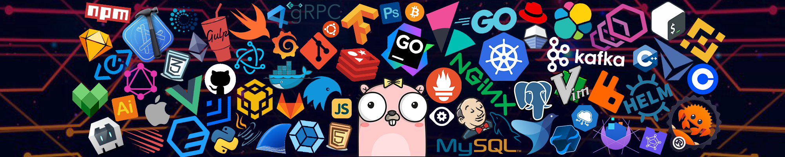

	

 

&emsp;
&emsp;
&emsp;
&emsp;
&emsp;

 

 

    
😊 Hello

	

我是一名在校学生😊，专业主修Java，平时喜欢写作✍️、听听歌🎵，码码代码💻，喝喝茶🍵，煮煮咖啡☕，代码水平很一般，关键有一颗助人为乐的心❤️，如果你发现作品有什么问题，或者烂透了的代码，请不要喷我，你可以通过我的邮箱ccenote@163.com 来与我交流，我愿意听取任何一个人的建议，再次感谢你的使用与支持😊。
    

